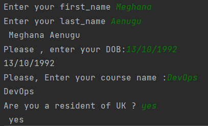
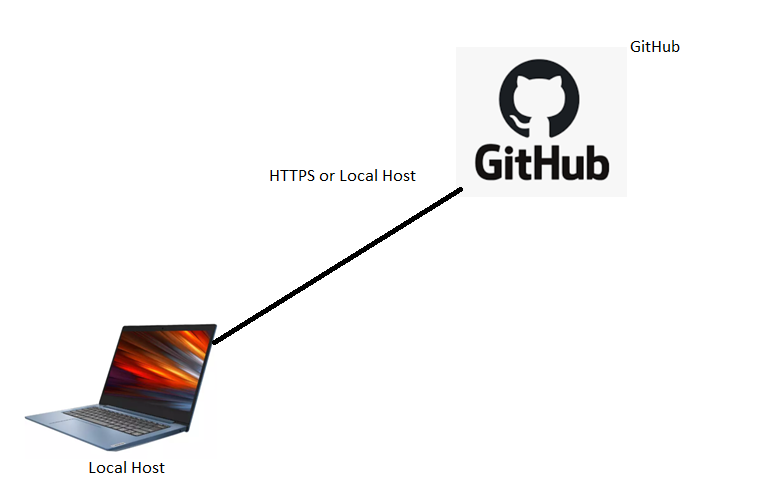

# Python intro
- Python is a popular programming language.
- Python can be used on a server to create web applications.
## Why Python

### Python use cases
- web development
- DevOps
- data science
- data analysis
- machine learning
- finance industry
### Python variables
- Variables are containers for storing data values.
- Python has no command for declaring a variable.
- A variable is created the moment you first assign a value to it.
### Example program to take input from the user and print to console.
```python
# Get user first_name and last_name
first_name=input("Enter your first_name") # Takes the input from the user and stores in the variable first_name
last_name=input("Enter your last_name") # Takes the input from the user and stores in the variable last_name

# display the names in the line
print(first_name + last_name )
dob=input("Please , enter your DOB:") # Takes the input dob from user
print(dob)
# course name
course_name=input("Please, Enter your course name :")
print(course_name)
# UK_resident
uk_resident =input ("Are you a resident of UK ?")
print(uk_resident)
```
### Output the console is 


# How to setup git+github using SSH key pair
- Install Git in your local machine
- Create a github account 
- We can connect local host to the github by twoways
    - SSH (Secure Shell)
    - HTTPS
- Step 1 :Generate ssh keys on localhost
- Step 2 :Keep the private key on local host inside the .ssh folder
- Step 3 :Copy the public key into your repository on github
- After doing the above three steps we can push anything to Github from our local machine and we can clone anything from Github to pur local machine.

## Points to be noted
- Always open Pycharm as administrator.
- Make sure you copy the public key without spaces and paste into repository
### Steps to push to github from local machine
- create README.md file in pycharm in local machine
- Add the notes 
- Use the below commands to push into the github
- git init
- git commit
- git commit -m "first commit"
- git add .
- git branch -M main
- git remote add origin git@github.com:meghanasrividya/git_github_setup.git
- git push -u origin main
